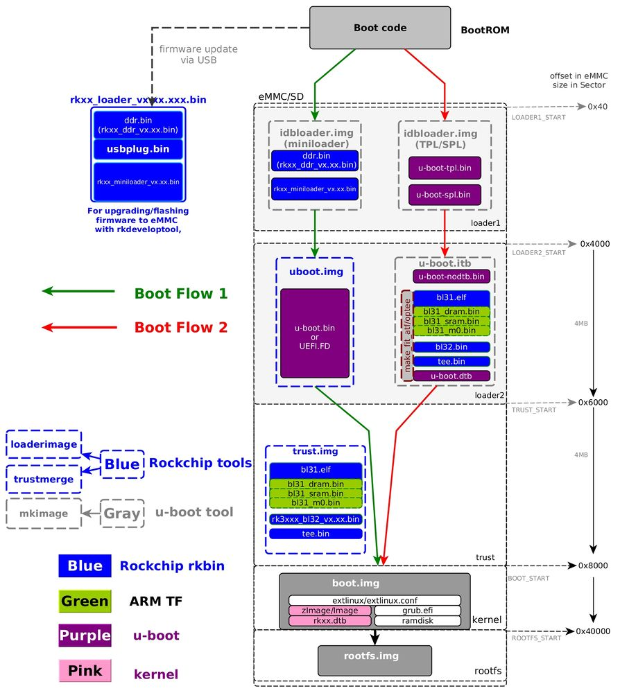

> https://opensource.rock-chips.com/wiki_Boot_option


# Boot flow

This chapter introduce the generic boot flow for Rockchip Application Processors, including the detail about what image we may use in Rockchip platform for kind of boot path:
- use U-Boot TPL/SPL from upsream or rockchip U-Boot, fully source code;
- use Rockchp idbLoader which is combinded by Rockchip ddr init bin and miniloader bin from Rockchip [rkbin](https://github.com/rockchip-linux/rkbin) project;
```
+--------+----------------+----------+-------------+---------+
| Boot   | Terminology #1 | Actual   | Rockchip    | Image   |
| stage  |                | program  |  Image      | Location|
| number |                | name     |   Name      | (sector)|
+--------+----------------+----------+-------------+---------+
| 1      |  Primary       | ROM code | BootRom     |         |
|        |  Program       |          |             |         |
|        |  Loader        |          |             |         |
|        |                |          |             |         |
| 2      |  Secondary     | U-Boot   |idbloader.img| 0x40    | pre-loader
|        |  Program       | TPL/SPL  |             |         |
|        |  Loader (SPL)  |          |             |         |
|        |                |          |             |         |
| 3      |  -             | U-Boot   | u-boot.itb  | 0x4000  | including u-boot and atf
|        |                |          | uboot.img   |         | only used with miniloader
|        |                |          |             |         |
|        |                | ATF/TEE  | trust.img   | 0x6000  | only used with miniloader
|        |                |          |             |         |
| 4      |  -             | kernel   | boot.img    | 0x8000  |
|        |                |          |             |         |
| 5      |  -             | rootfs   | rootfs.img  | 0x40000 |
+--------+----------------+----------+-------------+---------+
```
Then when we talking about boot from eMMC/SD/U-Disk/net, they are in different concept:
Stage 1 is always in boot rom, it loads stage 2 and may load stage 3(when SPL_BACK_TO_BROM option enabled).
- Boot from SPI flash means firmware for stage 2 and 3(SPL and U-Boot only) in SPI flash and stage 4/5 in other place;
- Boot from eMMC means all the firmware(including stage 2, 3, 4, 5) in eMMC;
- Boot from SD card means all the firmware(including stage 2, 3, 4, 5) in SD card;
- Boot from U-Disk means firmware for stage 4 and 5(not including SPL and U-Boot) in Disk, optionally only including stage 5;
- Boot from net/tftp means firmeware for stage 4 and 5(not including SPL and U-Boot) on the network;



Boot Flow 1 is typical Rockchip boot flow with Rockchip miniloader;
Boot Flow 2 is used for most SoCs with U-Boot TPL for ddr init and SPL for trust(ATF/OP-TEE) load and run into next stage;

Note 1. If loader1 have more than 1 stage, program will back to bootrom and bootrom load and run into next stage. eg. If loader1 is tpl and spl, the bootrom will run into tpl first, tpl init ddr and back to bootrom, bootrom then load and run into spl.
Note 2. If trust is enabled, loader1 need to load both trust and u-boot, and then run into trust in secure mode(EL3 in armv8), trust do the initialize and run into U-Boot in non-secure mode(EL2 in armv8).
Note 3. For trust(in trust.img or u-boot.itb), armv7 has only one tee.bin with or without ta, armv8 has bl31.elf and option with bl32.
Note 4. In boot.img, content can be zImage and its dtb for Linux, and can optionally be grub.efi, and can be AOSP boot.img, ramdisk is option;


# Package option

After we know about the boot stages,
Here are the file list before package for stage 2~4:

- From source code:
 - From U-Boot: u-boot-spl.bin, u-boot.bin(may use u-boot-nodtb.bin and u-boot.dtb instead),
 - From kernel: kernel Image/zImage file, kernel dtb,
 - From ATF: bl31.elf;
- From Rockchip binary:
 - ddr, usbplug, miniloader, bl31/op-tee, (all with chip 'rkxx_'  prefix and with version '_x.xx.bin' postfix);

We offer two different boot-loader methods for different solutions, the steps and request files are also complete different. But not all the platforms supports the both boot-loader methods. Here are the types to package image from those files:


# The Pre-bootloader(IDBLoader)

**What is idbloader**
idbloader.img is a Rockchip format pre-loader suppose to work at SoC start up, it contains:
- IDBlock header which is known by Rockchip BootRom;
- DRAM init program which is load by MaskRom and running at internal SRAM;
- loader for next stage which is load by MaskRom and running at DDR SDRAM;
You can get idbloader with below methods.

**Get idbloader for eMMC from Rockchip release loader**
No need to package a idbloader.img for eMMC if you are using Rockchip release loader, you can get idbloader on eMMC with below command:
```
rkdeveloptool db rkxx_loader_vx.xx.bin
rkdeveloptool ul rkxx_loader_vx.xx.bin
```

**Package the idbloader.img from Rockchip binary:**
For SD boot or eMMC(update with rockusb wl cmd), you need a idbloader(combinded with ddr and miniloader) .

tools/mkimage -n rkxxxx -T rksd -d rkxx_ddr_vx.xx.bin idbloader.img
cat rkxx_miniloader_vx.xx.bin >> idbloader.img

**Package the idbloader.img from U-Boot TPL/SPL(which is fully open source):**
```
tools/mkimage -n rkxxxx -T rksd -d tpl/u-boot-tpl.bin idbloader.img
cat spl/u-boot-spl.bin >> idbloader.img
```
Flash the idbloader.img to offset 0x40 which including stage 2, and you will need a uboot.img for boot stage 3.

- U-Boot
**uboot.img**
When using idbLoader from Rockchip miniloader, need package u-boot.bin into miniloader loadable format by Rockchip tool loaderimage.
```
tools/loaderimage --pack --uboot u-boot.bin uboot.img $SYS_TEXT_BASE
```
Where SoCs may have different $SYS_TEXT_BASE.

**u-boot.itb**
When using SPL to load the ATF/OP-TEE, package the bl31.bin, u-boot-nodtb.bin and uboot.dtb into one FIT image. You can skip the step to package the Trust image and flash that image in the next section.
```
make u-boot.itb
```
Note: please copy the trust binary() to u-boot root directory and rename it to tee.bin(armv7) or bl31.elf(armv8).

- Trust
**trust.img**
When using idbLoader from Rockchip miniloader, need package bl31.bin into miniloader loadable format by Rockchip tool trustmerge.
```
tools/trustmerge tools/rk_tools/RKTRUST_RKXXXXTRUST.ini
```
Flash the trust.img to offset 0x6000 which is for using Rockchip miniloader

**boot.img**
This image is package the kernel Image and dtb file into a know filesystem(FAT or EXT2) image for distro boot.

See [Install kernel](./rockchip_kernel.md) for detail about generate boot.img from kernel zImage/Image, dtb.

Flash the boot.img to offset 0x8000 which is stage 4.

**rootfs.img**
Flash the rootfs.img to offset 0x40000 which is stage 5. As long as the kernel you chosen can support that filesystem, there is not limit in the format of the image.

**rkxx_loader_vx.xx.xxx.bin**
This is provide by Rockchip in binary mode, which is used for firmware upgrade to eMMC with rkdeveloptool, can not be wirte to media device directly.

This is a package from ddr.bin, usbplug.bin, miniloader.bin, Rockchip tool DB command will make usbplug.bin running in target which perform as a Rockusb device. You can skip to package this image, Rockchip will offer this image at the most of time.

 
# Flash and boot from Media device
Here we introduce how to write image to different Medeia device.

Get image Ready:

- For with SPL:
 - idbloader.img
 - u-boot.itb
 - boot.img or boot folder with Image, dtb and exitlinulx inside
 - rootfs.img
- For with miniloader
 - idbloader.img
 - uboot.img
 - trust.img
 - boot.img or boot folder with Image, dtb and exitlinulx inside
 - rootfs.img
 

# Boot from eMMC
The eMMC is on the hardware board, so we need:

 - Get the board into maskrom mode;
 - Connect the target to PC with USB cable;
 - Flash the image to eMMC with rkdeveloptool
Example commands for flash image to target.

Flash the gpt partition to target:
```
rkdeveloptool db rkxx_loader_vx.xx.bin
rkdeveloptool gpt parameter_gpt.txt
```
- For with SPL:
```
rkdeveloptool db rkxx_loader_vx.xx.bin
rkdeveloptool wl 0x40 idbloader.img
rkdeveloptool wl 0x4000 u-boot.itb
rkdeveloptool wl 0x8000 boot.img
rkdeveloptool wl 0x40000 rootfs.img
rkdeveloptool rd
```
- For with miniloader
```
rkdeveloptool db rkxx_loader_vx.xx.bin
rkdeveloptool ul rkxx_loader_vx.xx.bin
rkdeveloptool wl 0x4000 uboot.img
rkdeveloptool wl 0x6000 trust.img
rkdeveloptool wl 0x8000 boot.img
rkdeveloptool wl 0x40000 rootfs.img
rkdeveloptool rd
```

# Boot from SD/TF Card
We can write SD/TF card with Linux PC dd command very easily.
Insert SD card to PC and we assume the /dev/sdb is the SD card device.

- For with SPL:
```
dd if=idbloader.img of=sdb seek=64
dd if=u-boot.itb of=sdb seek=16384
dd if=boot.img of=sdb seek=32768
dd if=rootfs.img of=sdb seek=262144
```

- For with miniloader:
```
dd if=idbloader.img of=sdb seek=64
dd if=uboot.img of=sdb seek=16384
dd if=trust.img of=sdb seek=24576
dd if=boot.img of=sdb seek=32768
dd if=rootfs.img of=sdb seek=262144
```
In order to make sure everything has write to SD card before unpluged, recommand to run below command:

```
sync
```
Note, when using boot from SD card, need to update the kernel cmdline(which is in extlinux.conf) for the correct root value.

```
append  earlyprintk console=ttyS2,115200n8 rw root=/dev/mmcblk1p7 rootwait rootfstype=ext4 init=/sbin/init
```
Write GPT partition table to SD card in U-Boot, and then U-Boot can find the boot partition and run into kernel.

```
gpt write mmc 0 $partitions
```
# Boot from U-Disk
Same as boot-from-sdcard, but please note that U-Disk only support stage 4 and 5, see Boot Stage for detail.
If U-Disk used for stage 4 and 5, format the U-Disk in gpt format and at least 2 partitions, write boot.img and rootfs.img in those partitions;
if U-Dist is only used for stage 5, we can dd the rootfs.img to U-Disk device directly.
Note, need to update the kernel cmdline(which is in extlinux.conf) for the correct root value.
```
append  earlyprintk console=ttyS2,115200n8 rw root=/dev/sda1 rootwait rootfstype=ext4 init=/sbin/init
```
